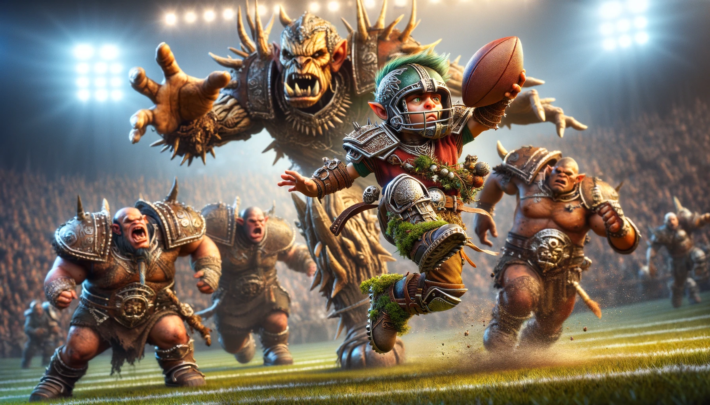

# Training how to use game theory using the Warhammer game known as "Blood Bowl"

### This site is designed to help you visualise a blood ball game between a halfling and undead team the rest of the league

#### Planning and Visualizing a Blood Bowl Game: Halfling vs. Undead

Organizing and imagining a match between a Halfling team and an Undead team in Blood Bowl offers up a feast of tactical considerations and thematic spectacle. Here, we'll delve into the essential traits and strategies of both sides and sketch out the dynamic tableau of their confrontation on the field.

***

#### Special Moves Table

<table><thead><tr><th width="190">Special Move</th><th width="257">Description</th><th>Dice Role Interaction and Probability Change</th></tr></thead><tbody><tr><td>Dodge</td><td>Increases evasion ability</td><td>Allows re-roll of failed dodge attempts</td></tr><tr><td>Throw Team-Mate</td><td>Enables throwing smaller players across the field</td><td>Success based on strength check; failure can result in player landing mishap</td></tr><tr><td>Block</td><td>Improves resistance to being knocked down</td><td>Adds a re-roll or favorable modifier to block attempts</td></tr><tr><td>Pass</td><td>Enhances throw accuracy</td><td>Adds a bonus to pass attempts, reducing failure chance</td></tr><tr><td>Catch</td><td>Improves likelihood of catching the ball</td><td>Provides re-roll or bonus for catch attempts</td></tr><tr><td>Sure Hands</td><td>Reduces fumbling on pickups</td><td>Negates the need for a re-roll on pickup failures; may automatically succeed on a certain roll</td></tr><tr><td>Mighty Blow</td><td>Increases chance of injuring an opponent</td><td>Adds a modifier to injury rolls, increasing severity of outcomes</td></tr><tr><td>Regeneration</td><td>Allows recovery from injuries</td><td>On injury, roll a die; on a successful roll, the player may return to the game</td></tr><tr><td>Sprint</td><td>Extends movement range</td><td>Allows additional movement beyond normal limit, no extra dice roll required</td></tr><tr><td>Side Step</td><td>Player chooses where they are pushed back to</td><td>Affects positioning without a direct dice roll but alters opponent's pushback options</td></tr></tbody></table>

**Halfling Team Overview**

Halfling teams, known for their underdog spirit, primarily rely on their agility and surprising plays rather than brute force. Their key characteristics include:

* **Resilience and Determination:** Despite their small size and perceived weaknesses, Halflings are notoriously hard to keep down for long.
* **Agility:** Their nimbleness allows them to attempt dodges and stunts that more cumbersome teams might not dare to try.
* **The Treeman Factor:** Halfling teams often include one or more Treemen, colossal allies that provide much-needed strength and stability.
* **Special Plays:** Halfling Chefs and other unique team advantages can disrupt the strategies of more conventional teams.

**Halfling Strategies:**

* **Hit and Run:** Halflings excel at darting in to grab the ball and nimbly escaping to score before opponents can react.
* **Distraction and Deception:** With their unique plays and unexpected tactics, Halflings can force opponents to spread their defense thin, exploiting weaknesses as they appear.

***

**Undead Team Overview**

Undead teams blend brute force with relentless pressure, their ranks bolstered by the living dead. Key aspects include:

* **Physical Resilience:** The Undead are hard to put down for good, often standing up to punishment that would sideline living players.
* **Varied Roster:** From the fast and nimble Ghouls to the mighty Mummies, Undead teams can adapt their strategy to many situations.
* **Regeneration:** Many Undead players have the chance to shrug off what would be serious injuries for others, keeping their team at strength even in a brutal match.
* **Fear Factor:** The sheer presence of the Undead can unnerve opponents, potentially affecting their performance.

**Undead Strategies:**

* **Attrition Warfare:** The Undead aim to wear down their opponents, using their resilience and the ability to replace fallen players easily.
* **Adaptability:** Depending on their opponents’ weaknesses, the Undead can shift their focus, using speed against slower teams and strength against weaker ones.

***

**The Clash on the Pitch**

* **The Setting:** Imagine the eerie, fog-laden pitch as the Halflings, cheerful yet determined, line up against the looming, silent figures of the Undead.
* **Early Game:** The Halflings might use their Treemen to engage the Mummies, trying to neutralize the Undead's strength advantage, while the smaller Halflings weave through the defenses.
* **Mid-Game:** As the game progresses, the Undead's relentless pressure begins to tell. Attrition can take its toll on the Halflings, though their chefs and special plays keep their spirits up.
* **Endgame and Scoring:** The Halflings, relying on sheer agility and audacious plays, might sneak in a score. However, the Undead’s methodical advance and ability to exploit any mistake can quickly shift the momentum.

***

In summary, visualizing a game between a Halfling and an Undead team requires an appreciation of both teams' distinctive strengths and tactics, imagining how these dynamics play out in the colorful, chaotic, and utterly unique setting of a Blood Bowl pitch.

## Understanding the Teams (life vs death) and their journey through a game of Blood Bowl creates the story

**The Halfling Team preparation/backstory:** Known for their agility and surprising resilience, Halflings are underdogs in Blood Bowl. They rely on their Treemen to provide muscle and throwing capability, while the Halflings themselves excel at dodging and unexpected plays. Their game strategy often involves avoiding direct confrontations and using their mobility to outmanoeuvre opponents.&#x20;

**Undead Team preparation/backstory:** The Undead bring a mix of speed (from Ghouls and Wights) and brute strength (from Mummies). Thanks to Regeneration and a generally sturdy lineup, they can absorb punishment and keep coming. Their strategy can be more straightforward, using their strength and resilience to dominate the field and control the ball with their faster units.

**Planning the Game** Setting: The game takes place in a classic Blood Bowl stadium, adorned with fans of both teams. The atmosphere is electric, with Halfling fans cooking up a feast in the stands, and Undead fans... eerily silent.

**Kickoff:** The Halflings will aim to use their Treemen to secure the ball and make quick passes until the Treeman can make enough space to throw a halfling catcher who's holding the ball over the Undead's heavy hitting defensive line. The Undead, on the other hand, will try to use their Mummies to break through the Halfling line and disrupt their play.

**Mid-Game:** Halflings will need to exploit any gaps they can find, using their agility to slip through Undead lines. The Undead will focus on controlling the pitch, using their Ghouls to chase down the ball and Wights to block Halfling movements.

**Endgame:** If the Halflings manage to stay clear of the Undead's grasp, they could pull off a surprise win with a swift touchdown. The Undead team will rely on grinding down the Halflings and securing the ball for a slow, relentless advance towards the Halfling end zone.

**Visualising the Game** Imagine a scene where a Halfling player is attempting a daring dodge around a Wight, ball in hand, aiming for a clear path to the end zone. In the background, a Treeman is engaged with a Mummy, fans from both sides are on their feet, and the rest of the players are positioned in a dynamic and tense formation, reflecting the critical moment of the game. This image captures the intensity and dynamics of the match, with key players in action and fans from both sides fully engaged in the spectacle. Use this visualization to enhance your planning and execution of the game, imagining the strategies and movements that could lead to victory or defeat for either side.

***

***

**Below:** tables for "special moves" and "cool traits" and a column summarizing dice roll interaction and changes in probability that helps to quantify their effects on gameplay, making it clearer how each move or trait influences the game's mechanics:

#### Cool Traits Table

<table><thead><tr><th width="179">Cool Trait</th><th width="191">Description</th><th>Dice Role Interaction and Probability Change</th></tr></thead><tbody><tr><td>Unbelievable Luck</td><td>Allows re-rolling unfavorable outcomes</td><td>Grants one re-roll per game or reduces penalty in specific situations</td></tr><tr><td>Expert at Sneaking Past Defenses</td><td>Increased chance to bypass tackle zones</td><td>Modifies or negates opponent's tackle zone effects for one action</td></tr><tr><td>Master Tactician</td><td>Provides team-wide bonus or strategic options</td><td>May allow a strategic play once per game that ignores or modifies normal rule constraints</td></tr><tr><td>Fearsome Presence</td><td>Reduces effectiveness of nearby opponents</td><td>Opponents within a certain radius may have a penalty on their actions</td></tr><tr><td>Can Cook a Mean Stew Mid-Game</td><td>Boosts team morale</td><td>Temporarily improves team stats or recovery rates, possibly through a morale roll</td></tr><tr><td>Intimidating Presence</td><td>Increases chance of opponents failing actions</td><td>Opponents have a penalty on actions or must re-roll successful actions within a certain radius</td></tr></tbody></table>

These tables synthesize the game's mechanics, offering clear insights into how each special move and cool trait directly impacts the outcomes of actions through dice rolls and probability changes. This structured approach not only aids in understanding and balancing gameplay but also enriches the strategic depth available to players.

