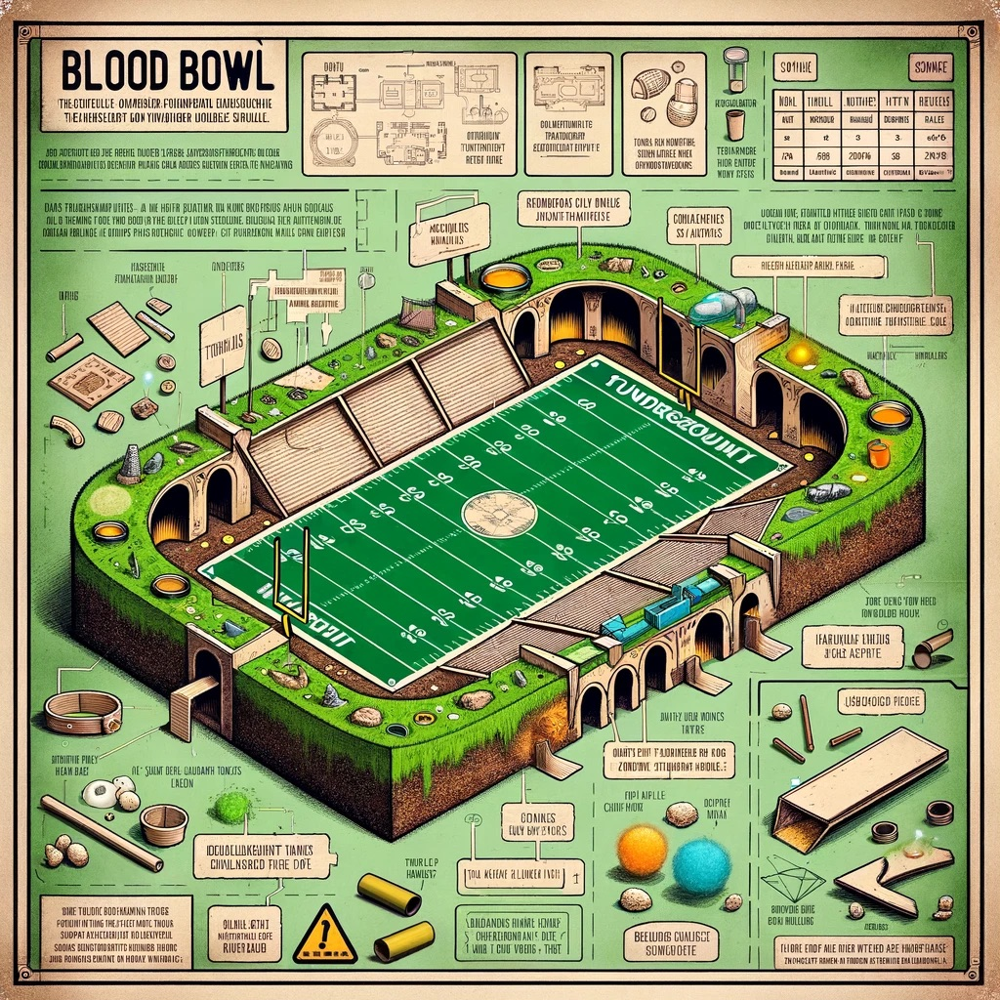
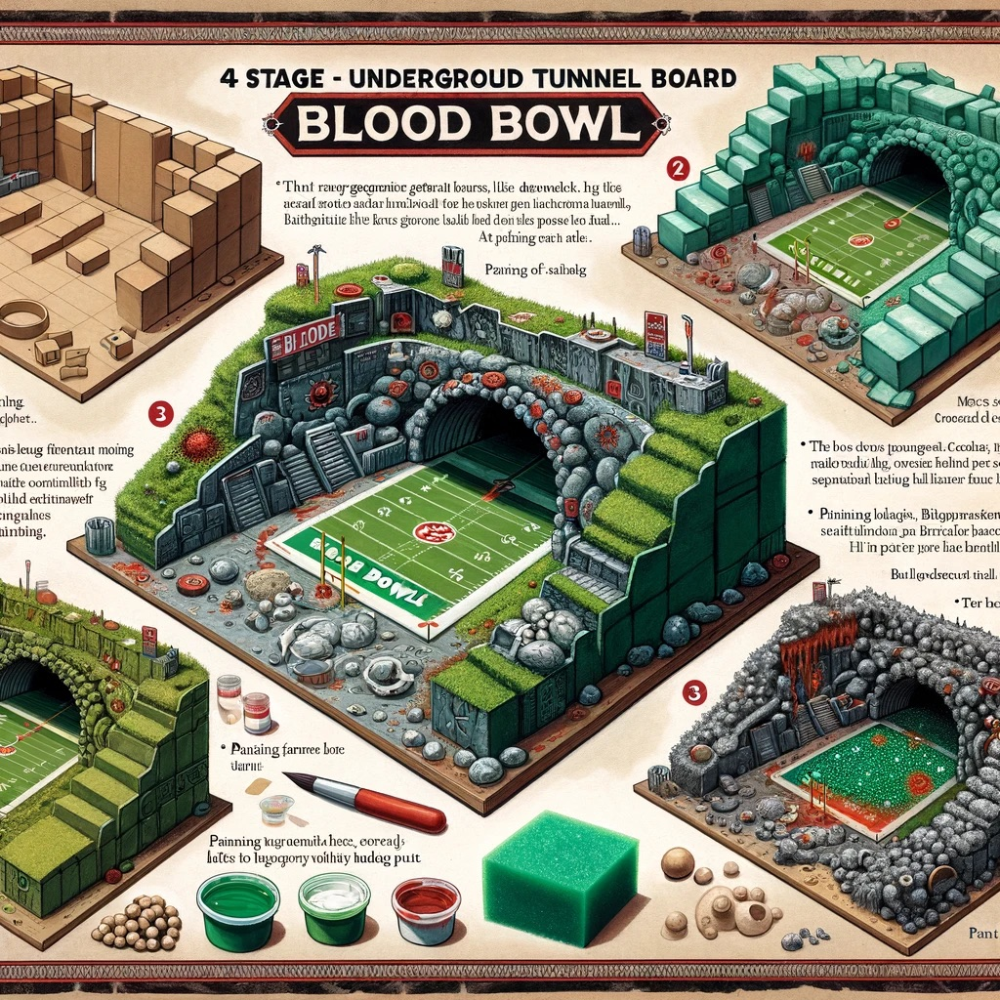
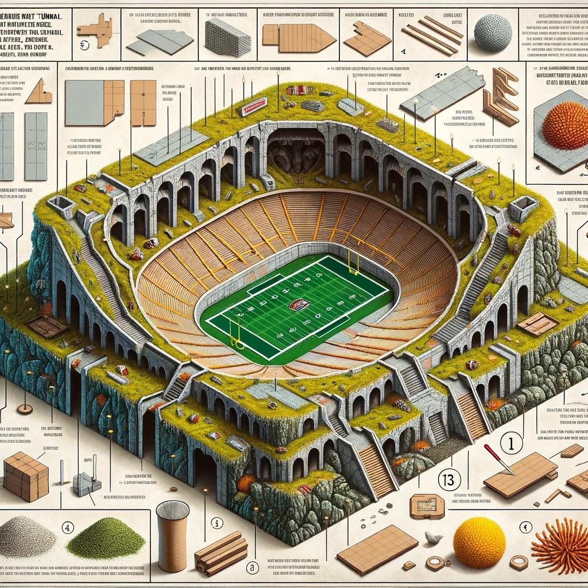
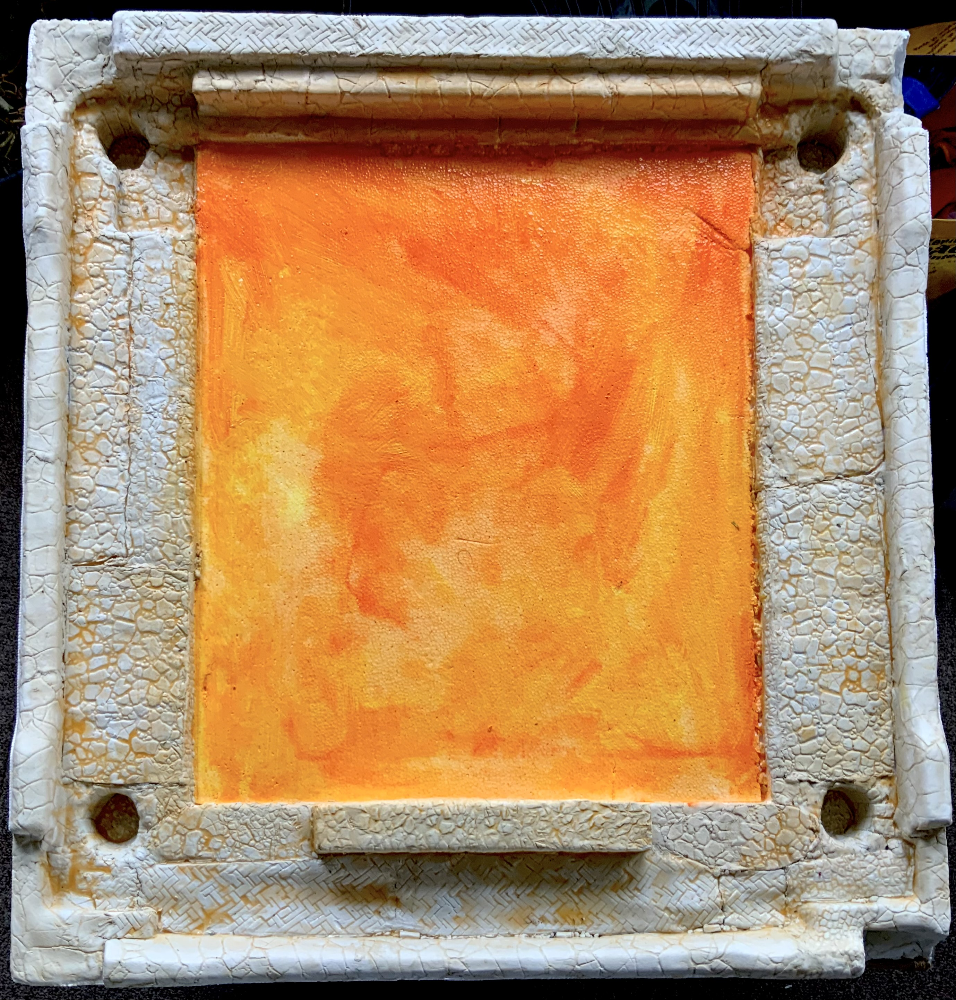
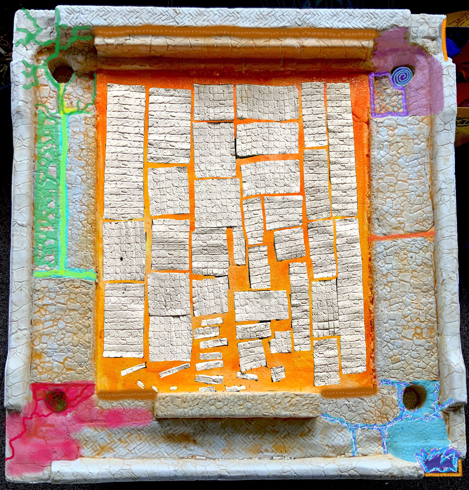
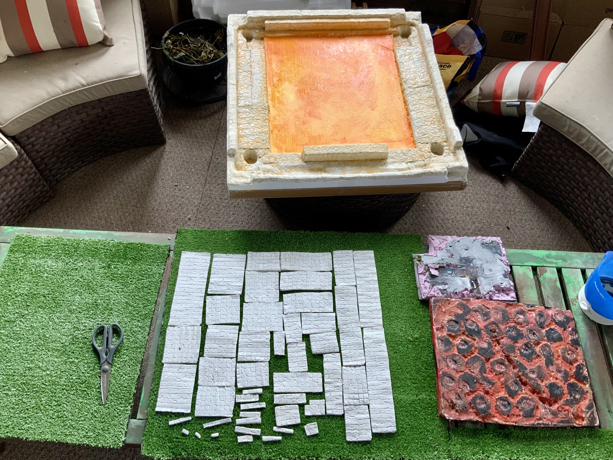

# Stadiums

Blood Bowl is a dynamic board game created by Games Workshop that can be played on virtually any surface or setting imaginable. Whether it's in dungeons, Martian tunnels, urban streets, or a steampunk-inspired speedball stadium, the game adapts seamlessly to your desired environment, ensuring a unique and engaging experience tailored to your team's theme.

\

Link to a 3D model of a blood bowl 7’s pitch.\

[https://www.thingiverse.com/thing:4078066/files](https://www.thingiverse.com/thing:4078066/files)\
\

There are also 3D printablevpitche designs for purchase

[https://www.printablescenery.com/product/fantasy-football-pitch/](https://www.printablescenery.com/product/fantasy-football-pitch/)\

\
Or this one is free and full size just minimal detail

[https://www.thingiverse.com/thing:3871382](https://www.thingiverse.com/thing:3871382)\

#### Standard Grassy Football Pitch for Humans

A typical grass football pitch for human play follows these standards: **Surface:** Natural grass, well-maintained for uniformity. **Markings:** White lines for boundaries, midfield, penalty areas, and center circle, aligning with international soccer criteria. This setup ensures an ideal playing field.

### Rocky tunnel design for goblins.

### The towering stadium with steep edges can be very dramatic for dwarfs.

### The towering stadium with a dramatic tunnel for dwarfs.&#x20;

Here’s a work in progress midway photoshoot. I’ve tried to use AI and doodle on ome to help plan the next stage, so far I’ve just put a lacier of clay on a polystyrene base and painted a central square orange. 2b continued.\

<figure><figcaption></figcaption></figure> <figure><figcaption></figcaption></figure> <figure><figcaption></figcaption></figure> <figure><figcaption></figcaption></figure>

