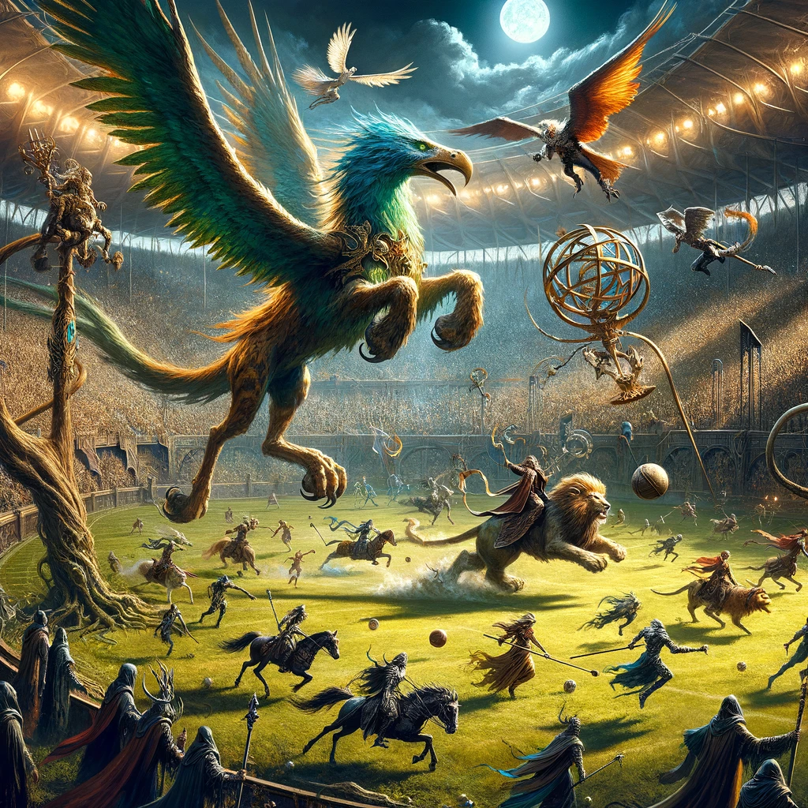

# Star players (more tbd…)

\*\* Star players can shift the balance of the game\*\*

These star players bring a high-fantasy element to the game, each with their unique abilities and strategies that can dramatically alter the flow of play. From aerial assaults and magical barrages to unstoppable charges and tactical dives, they add depth and excitement to the traditional Blood Bowl gameplay.

#### Attribute Scale:

* **Speed:** The capacity for rapid movement, crucial for positioning and covering the field.
* **Agility:** A reflection of dodging ability and finesse, important for tactical maneuvers.
* **Strength:** Physical prowess for engaging in and resisting blocks.
* **Toughness:** Endurance and the ability to withstand hits and injuries.
* **Type of Defense:**
  * **Mobile:** Can quickly cover ground and adjust to changing situations.
  * **Immovable:** Stands firm against opposition, holding strategic points.
  * **Strategic:** Uses intelligence and magical or tactical advantages.
  * **Aggressive Counter:** Directly confronts and overwhelms foes.
  * **Rampage:** Unpredictable and destructive, hard to control and counter.
  * **Blitz:** Focuses on swift, powerful charges to break through lines.
  * **Rapid Response:** Reacts swiftly to threats or opportunities, often from a distance.
  * **Evasive:** Utilizes speed and agility to avoid engagement and slip past defences.

This table contains an array of fantastical star players for a Blood Bowl-like setting, including a diverse array of characters and their unique mounts or traits, allowing for an imaginative expansion of the game. Here’s a detailed overview:

<table><thead><tr><th width="145">Name</th><th width="146">Role</th><th width="169">Special Moves</th><th width="141">Cool Traits</th><th width="109">Type of Defense</th><th>Speed</th><th>Agility</th><th>Strength</th><th>Toughness</th></tr></thead><tbody><tr><td>Elwind Swiftbeak</td><td>Wood Elf on Giant Bird</td><td>Aerial Assault, Precision Bombardment</td><td>Master of the skies</td><td>Mobile</td><td>10</td><td>5</td><td>3</td><td>7</td></tr><tr><td>Grootbranch the Ancient</td><td>Treeman</td><td>Mighty Blow, Take Root, Throw Team-Mate</td><td>Wisdom of the ages</td><td>Immovable</td><td>2</td><td>1</td><td>6</td><td>10</td></tr><tr><td>Zephyros the Bright</td><td>Wizard</td><td>Arcane Blast, Magical Shield</td><td>Controls the elements</td><td>Strategic</td><td>6</td><td>4</td><td>3</td><td>8</td></tr><tr><td>Nekhrun on Savage Lion</td><td>Necromancer Riding Lion</td><td>Dark Summoning, Fearsome Charge</td><td>Master of death and beasts</td><td>Aggressive Counter</td><td>8</td><td>3</td><td>4</td><td>9</td></tr><tr><td>Rattikin’s Deathwheel</td><td>Scavenge Death Wheel</td><td>Spinning Doom, Plague Aura</td><td>A whirlwind of destruction</td><td>Rampage</td><td>7</td><td>2</td><td>5</td><td>8</td></tr><tr><td>Pharaoh’s Curse</td><td>Skeleton Chariot</td><td>Bone Shatter Charge, Undying Servants</td><td>Relentless and unyielding</td><td>Blitz</td><td>9</td><td>2</td><td>5</td><td>9</td></tr><tr><td>Sir Galahad the Bold</td><td>Human Knight on Pegasus</td><td>Skyborne Lance, Valiant Rescue</td><td>Chivalry from above</td><td>Rapid Response</td><td>9</td><td>4</td><td>4</td><td>8</td></tr><tr><td>Aelarion Windrider</td><td>High Elf on Griffin</td><td>Graceful Strike, Majestic Dive</td><td>Nobility and ferocity combined</td><td>Evasive</td><td>10</td><td>5</td><td>4</td><td>7</td></tr></tbody></table>

###

### Wood Elf Star players

This table introduces a balanced mix of Wood Elf star players, each with their own unique skills, traits, and roles within the team. Aelarion "Skyhunter" Windrider, with his Giant Eagle mount, provides aerial support and mobility, while Tauron "Rootwall" Oakheart, the Treeman, serves as a formidable physical presence on the field. Elendil "Swiftfoot" Greenbough and Galadriel "Moonshadow" Starbreeze offer speed and agility, with Faelan "Branchbender" Willowborn adding strength and tactical prowess to the lineup. Together, these star players create a versatile and dynamic Wood Elf team ready to take on the challenges of Blood Bowl.

<table><thead><tr><th width="159">Name</th><th>Species</th><th>Primary Role</th><th width="139">Skills</th><th width="124">Cool Trait</th><th width="184">Defense Type</th><th>Animal Mount</th><th width="84">Speed</th><th width="80">Agility</th><th width="95">Strength</th><th width="57">Toughness</th></tr></thead><tbody><tr><td>Aelarion "Skyhunter" Windrider</td><td>Wood Elf</td><td>Thrower</td><td>Pass, Leap</td><td>Aerial Acrobat</td><td>Evasive (aerial mobility)</td><td>Giant Eagle</td><td>7</td><td>5</td><td>3</td><td>3</td></tr><tr><td>Tauron "Rootwall" Oakheart</td><td>Treeman</td><td>Lineman</td><td>Mighty Blow, Stand Firm</td><td>Nature's Guardian</td><td>Immovable (physical presence)</td><td>-</td><td>2</td><td>1</td><td>6</td><td>9</td></tr><tr><td>Elendil "Swiftfoot" Greenbough</td><td>Wood Elf</td><td>Catcher</td><td>Dodge, Sprint</td><td>Fleet of Foot</td><td>Evasive (speed and agility)</td><td>-</td><td>8</td><td>4</td><td>2</td><td>2</td></tr><tr><td>Galadriel "Moonshadow" Starbreeze</td><td>Wood Elf</td><td>Blitzer</td><td>Dodge, Leap</td><td>Ethereal Grace</td><td>Evasive (agility and stealth)</td><td>-</td><td>7</td><td>5</td><td>3</td><td>3</td></tr><tr><td>Faelan "Branchbender" Willowborn</td><td>Wood Elf</td><td>Blitzer</td><td>Block, Tackle</td><td>Unyielding</td><td>Balanced (strength and agility)</td><td>-</td><td>6</td><td>4</td><td>3</td><td>3</td></tr></tbody></table>

### Orc Champions

The **Black Orc Champion** epitomizes the zenith of orcish warfare, embodying not just extraordinary combat skills but also significant leadership abilities that rally and inspire their kin in battle. Towering in both stature and reputation, these champions are equipped with formidable weapons and bear the scars of countless conflicts, each telling a tale of victory. Beyond their unparalleled strength and fighting prowess, Black Orc Champions are strategic tacticians who can swiftly alter the course of battle in their favor. Their most distinctive trait, however, is their ability to inspire and embolden the orcish ranks, making any army led by them doubly formidable. The mere presence of a Black Orc Champion on the battlefield is a sign of the indomitable spirit of the orcish horde, making them not only crucial combatants but also symbolic leaders of their race's relentless and unconquerable resolve.

\
**Blood Bowl Star Player Summary:** Monstrous Mayhem from the combined strength of the green skin orc and goblin clans.

**Goblin Variants**:

* **With Chainsaw**: A goblin armed with a chainsaw, ready to cut down anything or anyone in its path.
* **On Pogo Stick**: A goblin uniquely equipped with a pogo stick, bouncing unpredictably during its raids.
* **With Explosives**: A goblin known for its love of explosives, often seen causing chaos with blasts.
* **And Swig**: This goblin enjoys a good swig now and then, perhaps making it more erratic.
* Troll: A large troll is strong and stupid.

<table><thead><tr><th width="153">Name</th><th width="176">Species</th><th width="170">Skills</th><th width="423">Cool Trait</th><th width="104">Primary Role</th><th width="110">Animal Mount</th><th width="169">Defense Type</th><th>Speed</th><th>Agility</th><th>Strength</th><th>Toughness</th></tr></thead><tbody><tr><td>Zugnog "Da Big 'Ed"</td><td>Black Orc</td><td>Block, Break Tackle, Frenzy</td><td>"Never Satisfied" - Gains bonuses to Strength and Aggression after each successful injury inflicted.</td><td>Blitzer</td><td>Goblin (Swig Holder)</td><td>Mixed (Goblin assists and armor)</td><td>3</td><td>2</td><td>6</td><td>5</td></tr><tr><td>Boom Git "Da Exploding Fool"</td><td>Goblin</td><td>Dodge, Leap, Bomber</td><td>"Unpredictable Kaboom" - Can throw bombs with surprising accuracy but also risks accidentally blowing himself up.</td><td>Bomber</td><td>Backpack of Bombs</td><td>Evasive (dodges and bombs)</td><td>4</td><td>4</td><td>3</td><td>3</td></tr><tr><td>Spikea "Da Bouncy Terror"</td><td>Goblin</td><td>Dodge, Leap, Tackle</td><td>"Always Bouncing" - Gains movement bonuses and can use his pogo stick for surprising dodges and tackles.</td><td>Disruptor</td><td>Pogo Stick</td><td>Evasive (pogo stick mobility)</td><td>5</td><td>5</td><td>2</td><td>3</td></tr><tr><td>Gnasher "Da Hackin' Maniac"</td><td>Goblin</td><td>Dodge, Mighty Blow, Chainsaw</td><td>"Can't Stop Sawin'" - Gains bonuses to attack rolls using his chainsaw but risks injuring himself on failed attempts.</td><td>Blitzer</td><td>None</td><td>Strength-based (chainsaw)</td><td>4</td><td>3</td><td>4</td><td>3</td></tr><tr><td>Gorknax "Da Devourer"</td><td>Troll</td><td>Block, Regeneration, Mighty Blow</td><td>"Endless Hunger" - Can regain lost health by eating downed enemies, but this also enrages him.</td><td>Destroyer</td><td>None</td><td>Strength-based (bulk)</td><td>2</td><td>2</td><td>7</td><td>7</td></tr><tr><td>Claw "Da Feral Beast"</td><td>Werewolf</td><td>Dodge, Leap, Frenzy</td><td>"Full Moon Fury" - Gains increased Strength and Agility during the full moon, but loses control at other times.</td><td>Blitzer</td><td>None</td><td>Mixed (agility and frenzy)</td><td>5</td><td>5</td><td>5</td><td>4</td></tr><tr><td>Ramses "Da Everlasting"</td><td>Undead (Mummy)</td><td>Regeneration, Stand Firm, Block</td><td>"Ancient Curse" - Difficult to injure permanently, but slow and sluggish.</td><td>Defender</td><td>None</td><td>Strength-based (armor)</td><td>2</td><td>2</td><td>5</td><td>5</td></tr><tr><td>"Da" Deadwood Daddy</td><td>Undead (Skeleton)</td><td>Pass, Dodge, Stunty</td><td>"Unyielding Spirit" - Never panics and can re-roll failed dodge rolls.</td><td>Runner</td><td>None</td><td>Evasive (dodges and agility)</td><td>4</td><td>4</td><td>2</td><td>3</td></tr><tr><td>"Lil" Rotgut</td><td>Undead (Halfling/Child)</td><td>Dodge, Leap, Stunty</td><td>"Slippery Soul" - Extremely difficult to grab or tackle due to his small size and spectral nature.</td><td>Ball Carrier</td><td>None</td><td>Evasive (agility and size)</td><td>4</td><td>5</td><td>2</td><td>2</td></tr><tr><td>Skully "Da Burnin' One"</td><td>Undead (Flaming Skeleton Demon)</td><td>Dodge, Leap, Flaming Weapon</td><td>"Infernal Touch" - Attacks set enemies ablaze, but Skully also risks taking fire damage.</td><td>Blitzer</td><td>None</td><td>Mixed (evasive and fiery)</td><td>4</td><td>3</td><td>4</td><td>3</td></tr></tbody></table>

### Undead star players

This table introduces a mix of Undead star players, each bringing their own unique skills and traits to the team. Morbidus "Deathwing" Graveheart, with his Zombie Dragon mount, offers aerial superiority and strength, while Vargulf "Bloodmane" Nightfang adds speed and predatory prowess on his lion mount. Lysandra "Soulreaper" Shadowveil, Gharak "Bonecrusher" Skullrend, and Eligos "Plaguebringer" Darkbloom provide a balanced blend of agility, strength, and tactical advantages to the Undead team, making them a formidable force in Blood Bowl.

### Mythical Beings

* **Flaming Skeleton**: A skeletal figure engulfed in perpetual flames, striking fear into the hearts of all who cross its path.
* **Demon Daddy and Mummy**: An ancient entity with demonic powers, wrapped in the garb of a mummy, blending horror from two realms.
* **Werewolf**: A fearsome combination of a troll's strength and a werewolf's ferocity, lurking in the shadows.

####

<table><thead><tr><th width="172">Name</th><th>Species</th><th width="152">Skills</th><th>Cool Trait</th><th>Animal Mount</th><th>Speed</th><th>Agility</th><th>Strength</th><th>Toughness</th><th>Defense Type</th><th>Primary Role</th></tr></thead><tbody><tr><td>Morbidus "Deathwing" Graveheart</td><td>Zombie</td><td>Regeneration, Block</td><td>Undying Resolve</td><td>Zombie Dragon</td><td>6</td><td>3</td><td>4</td><td>4</td><td>Strength-based (dragon's might)</td><td>Blitzer</td></tr><tr><td>Vargulf "Bloodmane" Nightfang</td><td>Vampire</td><td>Hypnotic Gaze, Regeneration</td><td>Predatory Instinct</td><td>Lion</td><td>7</td><td>4</td><td>4</td><td>4</td><td>Balanced (speed and strength)</td><td>Blitzer</td></tr><tr><td>Lysandra "Soulreaper" Shadowveil</td><td>Wight</td><td>Block, Tackle</td><td>Spectral Agility</td><td>-</td><td>6</td><td>4</td><td>3</td><td>8</td><td>Evasive (agility and resilience)</td><td>Lineman</td></tr><tr><td>Gharak "Bonecrusher" Skullrend</td><td>Mummy</td><td>Mighty Blow, Stand Firm</td><td>Unstoppable Force</td><td>-</td><td>3</td><td>1</td><td>5</td><td>9</td><td>Immovable (physical dominance)</td><td>Lineman</td></tr><tr><td>Eligos "Plaguebringer" Darkbloom</td><td>Ghoul</td><td>Dodge, Sure Hands</td><td>Infectious Fervor</td><td>-</td><td>7</td><td>3</td><td>3</td><td>7</td><td>Evasive (speed and ball handling)</td><td>Catcher</td></tr></tbody></table>

### Halfling Star Players with Unusual Mounts:

This table provides a structured overview of Halfling star players with unusual mounts, outlining their species, skills, cool traits, animal mounts, and key attributes such as speed, agility, strength, toughness, defence type, and primary role in the game. Pip's speed is boosted by his lema mount, making him a fast blitzer. Beatrice's duck mount provides some agility but is relatively fragile. Hamfast relies on his hippo's strength and bulk for his defence. Barnabas' hot air balloon grants him unique mobility and aerial advantages.

<table><thead><tr><th width="151">Name</th><th>Species</th><th width="91">Skills</th><th width="133">Cool Trait</th><th>Animal Mount</th><th>Speed</th><th>Agility</th><th>Strength</th><th>Toughness</th><th>Defense Type</th><th>Primary Role</th></tr></thead><tbody><tr><td>Pip "Galloping" Pipkington</td><td>Halfling</td><td>Leap, Dodge</td><td>Daring Daredevil</td><td>Lema</td><td>5</td><td>4</td><td>3</td><td>3</td><td>Evasive (dodges and mount speed)</td><td>Blitzer</td></tr><tr><td>Beatrice "Beaky" Bumblefoot</td><td>Halfling</td><td>Catch, Pass</td><td>Feathered Friend</td><td>Duck</td><td>4</td><td>5</td><td>2</td><td>2</td><td>Balanced (agility and mount)</td><td>Catcher</td></tr><tr><td>Hamfast "Mudstomper" Mudfoot</td><td>Halfling</td><td>Block, Dodge</td><td>Fearless</td><td>Hippo</td><td>2</td><td>2</td><td>5</td><td>5</td><td>Strength-based (hippo assistance)</td><td>Lineman</td></tr><tr><td>Barnabas "High Flyer" Bumblebrook</td><td>Halfling</td><td>Catch, Pass</td><td>Showman</td><td>Hot Air Balloon</td><td>4</td><td>4</td><td>3</td><td>2</td><td>Evasive (mobility and height)</td><td>Catcher</td></tr></tbody></table>

###

*

\

