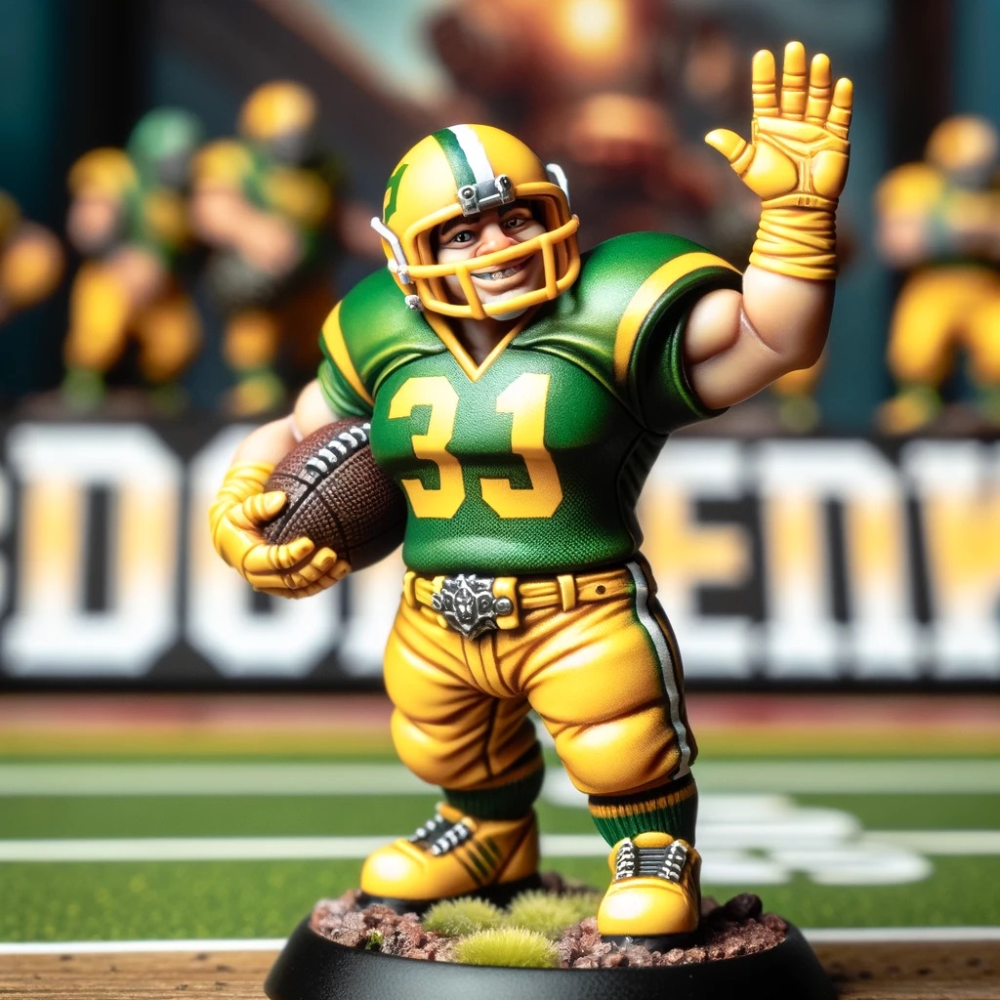
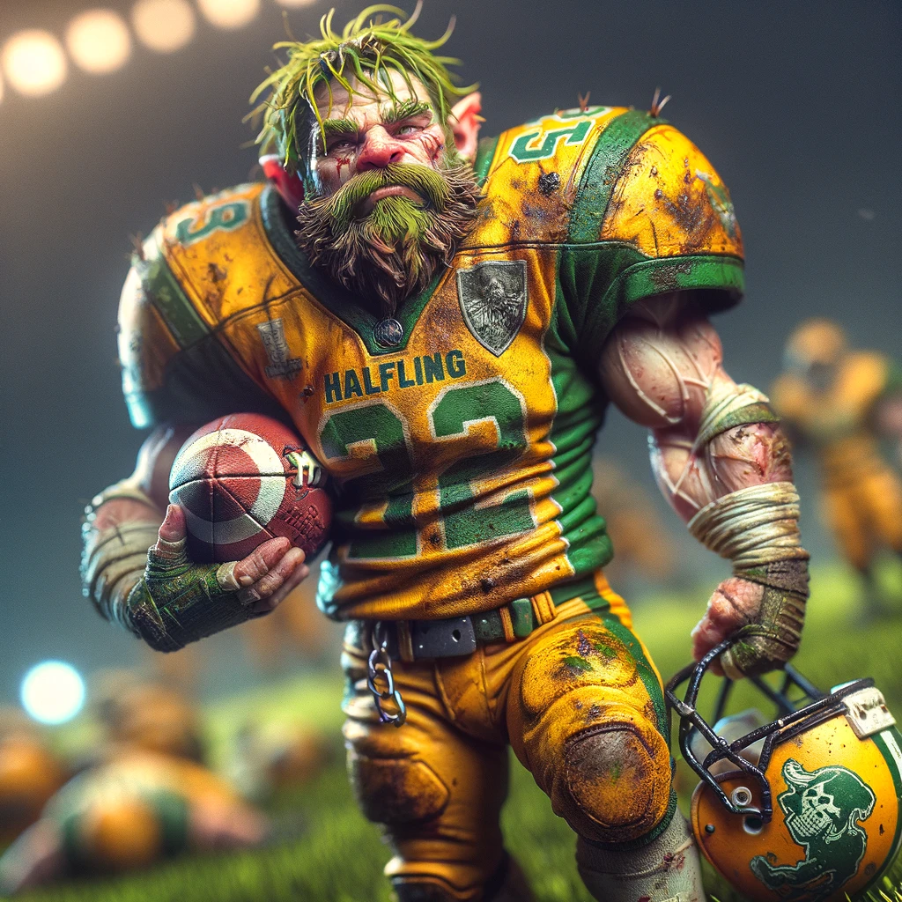

# Making and painting your halfling team

Master model painting is as much about patience and practice as it is about technique. Take your time with each step, allowing layers to dry fully before proceeding. Enjoy the process of bringing your Halflings to life with your painting!

### 1. **Base Layering**

* **Brown Base:** Start with a brown base over a black undercoat, this will nicely define the shadows and lower areas, giving your miniature depth right from the beginning.
* **Green:** Apply a mid-tone green to areas you want to highlight as clothing. This green should not be too bright initially, as you will build up to the brighter greens with layering.
* **Yellow:** For areas you wish to be yellow, start with a darker, mustard-like yellow. This will serve as a good base for brighter layers on top.

### 2. **Layering for Depth**

* **Green Layering:** Gradually add layers of brighter green on top of the initial green areas, focusing on raised sections and folds in the clothing to create a gradient effect. Leave the deeper areas in the darker green to maintain depth.
* **Yellow Highlights:** Apply a brighter yellow, leaving the darker mustard yellow visible in the recesses and shadows. This step enhances the volume and texture of the yellow areas.

### 3. **Detailing and Highlights**

* **Edge Highlighting Green Areas:** Use a very light green or mix a little white with your brightest green to do edge highlights on the most raised areas and edges of the green clothing.
* **Bright Yellow Finishing:** For the yellow areas, a final highlight with a very pale yellow or a mix of yellow and white will make these parts pop, focusing on edges and raised details.

### 4. **Finishing Touches**

* **Skin Tones:** Halflings are often depicted with warm, ruddy skin. Start with a base skin tone, layer up with lighter tones, and finish with fine highlights on cheeks, noses, and knuckles.
* **Facial Features and Details:** Use fine brushes for eyes, mouths, and any intricate details. A steady hand and a magnifying glass or painting visor can be invaluable here.
* **Washes and Glazes:** Use a brown wash to unify the model and deepen shadows, especially useful on the brown base areas and skin. Green and yellow glazes can intensify the vibrancy of clothing.

### 5. **Basing**

* **Thematic Base:** Consider a base that matches the Blood Bowl field or the Halfling's natural, rural environments. Use static grass, small pebbles, and maybe even a tiny ball to tie the model to its Blood Bowl origins.

### 6. **Sealing**

* Once completely dry, apply a matte varnish to protect your paint job during handling and gameplay. A gloss varnish can be applied to eyes or certain accessories if you want them to have a sheen.

***

***

***
