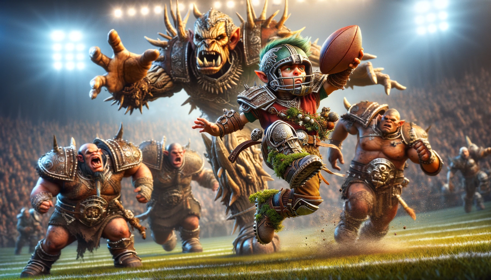

# The League

Welcome to the **Blood Bowl × Game Theory League** — a project exploring the use of LLMs to design and assist with the playing of board games like Blood Bowl, from team design and narrative to probability and strategy.

## 🕹️ Play the Arena Game

**[▶ Enter the Arena](game/)** — a fast, top-down arcade ball game in the spirit of classic 16-bit future-sports titles. Pick one of the league's eight teams, customise your roster, and play through the league season right in your browser.

## The Teams

| Team | Franchise |
| --- | --- |
| [Halflings](the-halfling-team.md) | Norwich Town of Northfolkshire |
| [Wood Elves](wood-elf-team.md) | The Floating Oaks |
| [Humans](human-team.md) | Arsenal |
| [Orcs](orc-team.md) | The Skull Crushers |
| [Undead](undead-team.md) | Chariots of Death |
| [Dwarves](dwarf-team.md) | The Dwarf Smashers |
| [Goblins](goblin-team.md) | The MadTown Green Goobers |
| [Vikings](viking-team.md) | The Frostheim Raiders |

## Learn the Game

- [How to play Blood Bowl](how-to-play-blood-bowl/README.md)
  - [Passing flow chart](how-to-play-blood-bowl/passing-flow-chart.md)
  - [Bomb flow chart](how-to-play-blood-bowl/bomb-flow-chart.md)
  - [Throw team-mate flow chart](how-to-play-blood-bowl/throw-team-mate-flow-chart.md)
- [Star players](Star_players/README.md)
- [Stadiums of the league](Stadiums/readme.md)
- [Making and painting your team](designing_team/README.md)
  - [Creating a thematic environment](designing_team/creating-a-thematic-and-detailed-environment-for-blood-bowl/README.md)
  - [50 tricks of the miniature construction trade](designing_team/50-tricks-of-the-miniture-construction-trade.md)
