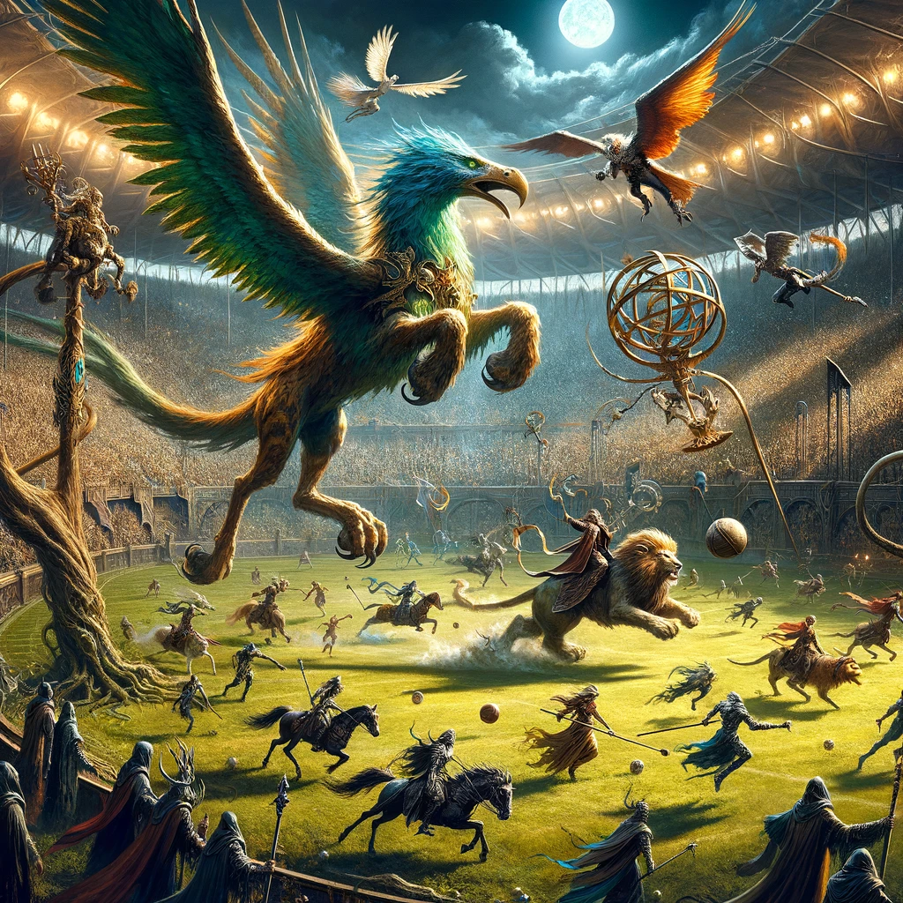

# The teams and their vital statistics

**Halfling team name:**

Incorporating numerical attributes for speed, agility, strength, and toughness, along with a brief description of their type of defense, provides a more comprehensive look at the capabilities and strategies of each player on the expanded Halfling team. Here's an enhanced table with these details:

<table><thead><tr><th width="152">Name</th><th>Role</th><th>Special Moves</th><th>Cool Traits</th><th>Speed</th><th>Agility</th><th>Strength</th><th>Toughness</th><th>Type of Defense</th></tr></thead><tbody><tr><td>Pippin Tuck</td><td>Halfling Hopeful</td><td>Dodge, Stunty</td><td>Unbelievable luck</td><td>6</td><td>3</td><td>2</td><td>6</td><td>Evasive</td></tr><tr><td>Merry Brandybuck</td><td>Halfling Hopeful</td><td>Dodge, Stunty</td><td>Cooks mid-game</td><td>6</td><td>3</td><td>2</td><td>6</td><td>Evasive</td></tr><tr><td>Fatty Lumpkin</td><td>Treeman</td><td>Throw Team-Mate, Take Root</td><td>Never forgets</td><td>2</td><td>1</td><td>6</td><td>9</td><td>Anchored</td></tr><tr><td>Twiglet</td><td>Treeman</td><td>Throw Team-Mate, Take Root</td><td>Bird's nest</td><td>2</td><td>1</td><td>6</td><td>9</td><td>Anchored</td></tr><tr><td>Bilbo Baggs</td><td>Hefty</td><td>Sure Hands, Pass</td><td>Sneaks past defenses</td><td>5</td><td>3</td><td>3</td><td>7</td><td>Supportive</td></tr><tr><td>Samwise Gamgee</td><td>Catcher</td><td>Catch, Dodge</td><td>Boosts morale</td><td>6</td><td>4</td><td>2</td><td>6</td><td>Mobile</td></tr><tr><td>Frodo Footpad</td><td>Halfling Hopeful</td><td>Dodge, Stunty</td><td>Escapes tackles</td><td>6</td><td>3</td><td>2</td><td>6</td><td>Evasive</td></tr><tr><td>Lobelia Sackville</td><td>Halfling Hopeful</td><td>Dodge, Stunty</td><td>Interception expert</td><td>6</td><td>3</td><td>2</td><td>6</td><td>Opportunistic</td></tr><tr><td>Tom Bombadil</td><td>Halfling Hopeful</td><td>Side Step, Dodge</td><td>Confuses foes</td><td>6</td><td>3</td><td>2</td><td>6</td><td>Evasive</td></tr><tr><td>Barliman Butterbur</td><td>Hefty</td><td>Sure Hands, Leader</td><td>Inspirational leader</td><td>5</td><td>3</td><td>3</td><td>7</td><td>Strategic</td></tr><tr><td>Rosie Cotton</td><td>Catcher</td><td>Sprint, Catch</td><td>Fastest in the Shire</td><td>7</td><td>4</td><td>2</td><td>6</td><td>Rapid Response</td></tr><tr><td>Farmer Maggot</td><td>Halfling Hopeful</td><td>Tackle, Fend</td><td>Tough and resilient</td><td>6</td><td>3</td><td>2</td><td>7</td><td>Aggressive Counter</td></tr></tbody></table>

#### Attribute Scale:

* **Speed:** Measured on a scale where higher numbers indicate faster movement across the pitch.
* **Agility:** Reflects the player's ability to dodge and handle the ball, with higher values indicating greater skill.
* **Strength:** Determines physical power for blocking and resisting tackles.
* **Toughness:** Indicates resilience against injuries, with higher numbers showing greater durability.
* **Type of Defense:**
  * **Evasive:** Focuses on dodging and avoiding tackles.
  * **Anchored:** Uses physical presence to block and control areas.
  * **Supportive:** Plays that assist other team members defensively.
  * **Mobile:** Quick to adjust and reposition defensively.
  * **Opportunistic:** Exploits momentary weaknesses in the opponent's offense.
  * **Strategic:** Uses foresight and positioning to strengthen defense.
  * **Rapid Response:** Quickly covers ground to intercept or tackle.
  * **Aggressive Counter:** Actively seeks to tackle and disrupt the offense.

This enhanced breakdown gives a clearer picture of how each Halfling team member can contribute to both offense and defense, highlighting their unique abilities and strategies for overcoming the challenges posed by opposing teams.

***

**Undead team name: Chariots of death.**

For the Undead team rivaling the living team, let's create a lineup that showcases their unique strengths and styles, complete with numerical attributes for speed, agility, strength, and toughness, as well as a brief description of their type of defense:

| Name         | Role     | Special Moves             | Cool Traits                     | Speed | Agility | Strength | Toughness | Type of Defense    |
| ------------ | -------- | ------------------------- | ------------------------------- | ----- | ------- | -------- | --------- | ------------------ |
| Gravewalker  | Zombie   | Regeneration              | Unyielding resilience           | 4     | 2       | 3        | 8         | Anchored           |
| Bonecruncher | Mummy    | Mighty Blow, Regeneration | Terrifying presence             | 3     | 1       | 5        | 9         | Immovable          |
| Shadowswift  | Wight    | Block, Regeneration       | Master tactician                | 6     | 3       | 3        | 8         | Strategic          |
| Ghoulcatcher | Ghoul    | Dodge, Sure Hands         | Eerily fast                     | 7     | 3       | 3        | 7         | Mobile             |
| Nightshroud  | Wight    | Block, Regeneration       | Inspires fear                   | 6     | 3       | 3        | 8         | Strategic          |
| Tombdancer   | Skeleton | Block, Thick Skull        | Deceptively agile               | 5     | 2       | 3        | 7         | Evasive            |
| Screamweaver | Ghoul    | Dodge, Sure Hands         | Sudden bursts of speed          | 7     | 3       | 3        | 7         | Rapid Response     |
| Deadweight   | Zombie   | Regeneration              | Unstoppable once moving         | 4     | 2       | 3        | 8         | Anchored           |
| Skullflinger | Skeleton | Block, Thick Skull        | Exceptional at interceptions    | 5     | 2       | 3        | 7         | Opportunistic      |
| Darkwhisper  | Ghoul    | Dodge, Sure Hands         | Silent but deadly               | 7     | 3       | 3        | 7         | Mobile             |
| Cryptkeeper  | Mummy    | Mighty Blow, Regeneration | Dominates the line of scrimmage | 3     | 1       | 5        | 9         | Immovable          |
| Soulreaper   | Wight    | Block, Regeneration       | Expert at soul-sapping tackles  | 6     | 3       | 3        | 8         | Aggressive Counter |

#### Attribute Scale:

* **Speed:** The maximum tiles a player can move per turn, with higher values for faster units.
* **Agility:** A measure of how easily a player can dodge or catch the ball.
* **Strength:** Affects blocking and resisting blocks, with higher values indicating stronger players.
* **Toughness:** Reflects resistance to being injured.
* **Type of Defense:**
  * **Anchored:** Uses their presence to block and control space.
  * **Immovable:** Hard to move or knock down, making them effective at holding lines.
  * **Strategic:** Uses intelligence and foresight to disrupt offensive plays.
  * **Mobile:** Fast and able to cover large parts of the field quickly.
  * **Evasive:** Skilled at avoiding tackles and slipping through the opponent's grasp.
  * **Rapid Response:** Can quickly move to intercept or engage threats.
  * **Opportunistic:** Takes advantage of any mistake or opportunity presented by the opponent.
  * **Aggressive Counter:** Actively seeks to tackle and disrupt, focusing on taking down key players.

This lineup of the Undead team highlights their blend of brute strength, tactical prowess, and eerie agility, making them a formidable opponent for any team, including the nimble Halflings. Their unique mix of zombies, ghouls, skeletons, wights, and mummies brings diverse strategies and challenges to the pitch.

***

**Orc team name:**

Creating a rival Orc team to face off against the Halflings involves showcasing the Orcs' characteristic blend of brute strength and surprising agility in some positions. Here's how an Orc Blood Bowl team could be structured, complete with their roles, special moves, cool traits, and numerical attributes for speed, agility, strength, and toughness, plus a minimal description of their type of defense:

| Name             | Role      | Special Moves              | Cool Traits           | Speed | Agility | Strength | Toughness | Type of Defense    |
| ---------------- | --------- | -------------------------- | --------------------- | ----- | ------- | -------- | --------- | ------------------ |
| Grot Snaggle     | Lineman   |                            | Never backs down      | 5     | 3       | 3        | 9         | Anchored           |
| Uzgob Smashgit   | Black Orc | Guard                      | Immovable object      | 4     | 2       | 4        | 9         | Immovable          |
| Grimgor Gouger   | Blitzer   | Block                      | Lives for the Blitz   | 6     | 3       | 3        | 8         | Aggressive Counter |
| Skarfang Skuller | Thrower   | Sure Hands, Pass           | Strategic thinker     | 5     | 3       | 3        | 8         | Supportive         |
| Wazzbad Powkick  | Blitzer   | Block                      | Fearsome in a fight   | 6     | 3       | 3        | 8         | Aggressive Counter |
| Nobbla Stomper   | Lineman   |                            | Tough as nails        | 5     | 3       | 3        | 9         | Anchored           |
| Zogoth the Mean  | Black Orc | Guard                      | Commands the line     | 4     | 2       | 4        | 9         | Immovable          |
| Grod Badthrow    | Thrower   | Sure Hands, Pass           | Unnervingly accurate  | 5     | 3       | 3        | 8         | Strategic          |
| Muzgash Maimer   | Blitzer   | Block                      | Quick to anger        | 6     | 3       | 3        | 8         | Rapid Response     |
| Gashnak Breaker  | Black Orc | Guard                      | Unyielding            | 4     | 2       | 4        | 9         | Immovable          |
| Snikrot Sneaky   | Goblin    | Dodge, Stunty, Right Stuff | Slippery and sly      | 6     | 3       | 2        | 7         | Evasive            |
| Badruk Bashface  | Blitzer   | Block                      | Intimidating presence | 6     | 3       | 3        | 8         | Aggressive Counter |

#### Attribute Scale:

* **Speed:** Measures how fast a player can move, affecting their ability to cover ground on the pitch.
* **Agility:** Indicates how well a player can dodge out of tackles and handle the ball.
* **Strength:** Affects the ability to block opponents and resist being blocked.
* **Toughness:** Reflects how resistant a player is to injuries.
* **Type of Defense:**
  * **Anchored:** Stays put, making it hard for opponents to break through.
  * **Immovable:** Exceptionally tough to move or knock down, excellent for holding the line.
  * **Aggressive Counter:** Prefers to take the fight to the opponent, often breaking through their lines.
  * **Supportive:** Plays a role in bolstering the team's defense or offense, often through passing or strategic positioning.
  * **Strategic:** Utilizes tactical knowledge to disrupt the opponent's plays.
  * **Rapid Response:** Quick to adapt and move to where they're most needed.
  * **Evasive:** Utilizes agility and speed to avoid tackles and slip through the defense.

This Orc team combines raw power with a dash of cunning, courtesy of their Goblins, making them a force to be reckoned with on the Blood Bowl pitch. Their strategy revolves around using their strength to dominate the line of scrimmage, while Blitzers and the occasional agile Goblin create opportunities for dynamic plays.

***

**Human team name:**

!(Human team)\[/Images/Dalle4\_human\_field.webp]

Crafting a Human Blood Bowl team to rival the Halflings emphasizes the humans' balanced approach to the game, blending speed, agility, and strength in a versatile lineup. Here's a detailed breakdown of a Human team, featuring their roles, special moves, cool traits, and numerical attributes, along with a brief description of their defensive style:

<table><thead><tr><th width="146">Name</th><th>Role</th><th>Special Moves</th><th width="114">Cool Traits</th><th>Speed</th><th>Agility</th><th>Strength</th><th>Toughness</th><th>Type of Defense</th></tr></thead><tbody><tr><td>Alric the Accurate</td><td>Thrower</td><td>Sure Hands, Pass</td><td>Precision under pressure</td><td>6</td><td>3</td><td>3</td><td>8</td><td>Supportive</td></tr><tr><td>Berin Fastfoot</td><td>Catcher</td><td>Catch, Dodge</td><td>Lightning speed</td><td>8</td><td>4</td><td>2</td><td>7</td><td>Rapid Response</td></tr><tr><td>Gorin Stoutarm</td><td>Blitzer</td><td>Block</td><td>Relentless tackler</td><td>7</td><td>3</td><td>3</td><td>8</td><td>Aggressive Counter</td></tr><tr><td>Helfdan the Swift</td><td>Catcher</td><td>Catch, Dodge</td><td>Unmatched agility</td><td>8</td><td>4</td><td>2</td><td>7</td><td>Mobile</td></tr><tr><td>Olaf Hammerfist</td><td>Blitzer</td><td>Block</td><td>Fears no foe</td><td>7</td><td>3</td><td>3</td><td>8</td><td>Aggressive Counter</td></tr><tr><td>Sigurd Strongarm</td><td>Lineman</td><td></td><td>Steadfast and reliable</td><td>6</td><td>3</td><td>3</td><td>8</td><td>Anchored</td></tr><tr><td>Erik Ironshield</td><td>Lineman</td><td></td><td>Iron-willed</td><td>6</td><td>3</td><td>3</td><td>8</td><td>Anchored</td></tr><tr><td>Lars the Leader</td><td>Lineman</td><td>Leader</td><td>Inspires the team</td><td>6</td><td>3</td><td>3</td><td>8</td><td>Strategic</td></tr><tr><td>Ragnar the Rock</td><td>Ogre</td><td>Mighty Blow, Thick Skull</td><td>Mountain of muscle</td><td>5</td><td>2</td><td>5</td><td>9</td><td>Immovable</td></tr><tr><td>Thorvald Thunder</td><td>Lineman</td><td></td><td>Never gives up</td><td>6</td><td>3</td><td>3</td><td>8</td><td>Anchored</td></tr><tr><td>Bjorn Bearclaw</td><td>Blitzer</td><td>Block</td><td>Master of the blitz</td><td>7</td><td>3</td><td>3</td><td>8</td><td>Aggressive Counter</td></tr><tr><td>Wilhelm Windrunner</td><td>Catcher</td><td>Catch, Dodge</td><td>Slippery and swift</td><td>8</td><td>4</td><td>2</td><td>7</td><td>Evasive</td></tr></tbody></table>

#### Attribute Scale:

* **Speed:** Indicates the player's movement capability, with higher numbers allowing for greater mobility on the field.
* **Agility:** Reflects the player's ability to perform agile maneuvers, including dodging and ball handling.
* **Strength:** Measures the player's physical power for blocking and resisting tackles.
* **Toughness:** Denotes the player's durability and resistance to injuries.
* **Type of Defense:**
  * **Supportive:** Provides crucial support, either through passing, blocking, or strategic playmaking.
  * **Rapid Response:** Quickly covers ground to tackle or reposition as needed.
  * **Aggressive Counter:** Prefers to confront and overpower opponents directly.
  * **Mobile:** Utilizes speed and agility to adapt and counter opposing moves.
  * **Anchored:** Holds their ground, forming a solid defensive line against attackers.
  * **Strategic:** Uses tactical knowledge and positioning to outmaneuver the opposition.
  * **Immovable:** Acts as a formidable barrier, difficult to bypass or knock down.

This Human team showcases the race's adaptability and balanced approach to the game, capable of shifting strategies and roles as the situation demands. Their mix of speed in the Catchers, strength in the Blitzers and Ogre, and reliable Linemen allows them to compete effectively across all aspects of Blood Bowl.

***

**Wood Elf team name:**

Designing a Wood Elf Blood Bowl team emphasizes their exceptional agility, speed, and ball-handling skills, making them one of the most dynamic and mobile teams on the pitch. Here's a detailed breakdown of a Wood Elf team, with their roles, special moves, cool traits, numerical attributes for speed, agility, strength, and toughness, and a brief description of their type of defense:

<table><thead><tr><th width="135">Name</th><th>Role</th><th width="145">Special Moves</th><th>Cool Traits</th><th>Speed</th><th>Agility</th><th>Strength</th><th>Toughness</th><th>Type of Defense</th></tr></thead><tbody><tr><td>Thalan Underbow</td><td>Thrower</td><td>Pass, Safe Throw</td><td>Precision passer</td><td>7</td><td>4</td><td>3</td><td>7</td><td>Supportive</td></tr><tr><td>Finrod Leafwalker</td><td>Catcher</td><td>Catch, Dodge, Sprint</td><td>Unparalleled speed</td><td>8</td><td>4</td><td>2</td><td>7</td><td>Mobile</td></tr><tr><td>Aerol Swiftfoot</td><td>Catcher</td><td>Catch, Dodge, Sprint</td><td>Master of evasion</td><td>8</td><td>4</td><td>2</td><td>7</td><td>Evasive</td></tr><tr><td>Galion Greenstride</td><td>Wardancer</td><td>Block, Dodge, Leap</td><td>Acrobatic disruptor</td><td>8</td><td>4</td><td>3</td><td>7</td><td>Aggressive Counter</td></tr><tr><td>Cirdan Skyrunner</td><td>Wardancer</td><td>Block, Dodge, Leap</td><td>Graceful yet deadly</td><td>8</td><td>4</td><td>3</td><td>7</td><td>Aggressive Counter</td></tr><tr><td>Tauriel Quickbark</td><td>Lineman</td><td></td><td>Swift and silent</td><td>7</td><td>4</td><td>3</td><td>7</td><td>Anchored</td></tr><tr><td>Legolin Arrowshot</td><td>Lineman</td><td></td><td>Sharp-eyed observer</td><td>7</td><td>4</td><td>3</td><td>7</td><td>Strategic</td></tr><tr><td>Elrohir Starlight</td><td>Lineman</td><td></td><td>Nimble and quick-thinking</td><td>7</td><td>4</td><td>3</td><td>7</td><td>Anchored</td></tr><tr><td>Haldir Leafshade</td><td>Lineman</td><td></td><td>Blends into the pitch</td><td>7</td><td>4</td><td>3</td><td>7</td><td>Opportunistic</td></tr><tr><td>Gildor Inglorion</td><td>Lineman</td><td></td><td>Never caught off-guard</td><td>7</td><td>4</td><td>3</td><td>7</td><td>Strategic</td></tr><tr><td>Beleg Strongbow</td><td>Lineman</td><td></td><td>Unwavering focus</td><td>7</td><td>4</td><td>3</td><td>7</td><td>Anchored</td></tr><tr><td>Celeborn the Wise</td><td>Treeman</td><td>Mighty Blow, Take Root, Throw Team-Mate</td><td>Ancient and wise</td><td>2</td><td>1</td><td>6</td><td>10</td><td>Immovable</td></tr></tbody></table>

#### Attribute Scale:

* **Speed:** Reflects how quickly a player can move across the pitch, with Wood Elves being among the fastest.
* **Agility:** Indicates the player's skill in dodging and ball handling, with Wood Elves excelling in this area.
* **Strength:** Measures physical power for blocking and resisting blocks, typically lower for Wood Elves.
* **Toughness:** Denotes resilience against injuries, with Wood Elves being somewhat fragile.
* **Type of Defense:**
  * **Supportive:** Provides crucial backing, especially in passing and strategic plays.
  * **Mobile:** Highly adept at moving quickly to adapt or reposition.
  * **Evasive:** Specializes in avoiding tackles and slipping through defenses.
  * **Aggressive Counter:** Uses agility and speed to disrupt opponents' plays.
  * **Anchored:** Uses positioning and agility to form a flexible defensive line.
  * **Strategic:** Employs foresight and agility to outmaneuver opponents.
  * **Opportunistic:** Takes advantage of openings and mistakes by the opponent.
  * **Immovable:** Acts as a solid obstacle, difficult to move or bypass.

Wood Elf teams excel in making rapid, agile plays, relying on their unmatched speed and agility to outpace and outmaneuver the opposition. They can be vulnerable to physical teams due to their lower strength and toughness but often compensate with their mobility and ball-handling prowess.

***

\*\* Star players can shift the balance of the game\*\*

Creating a table of fantastical star players for a Blood Bowl-like setting, including a diverse array of characters and their unique mounts or traits, allows for an imaginative expansion of the game. Here’s a detailed overview:

<table><thead><tr><th width="145">Name</th><th width="146">Role</th><th>Special Moves</th><th>Cool Traits</th><th>Speed</th><th>Agility</th><th>Strength</th><th>Toughness</th><th>Type of Defense</th></tr></thead><tbody><tr><td>Elwind Swiftbeak</td><td>Wood Elf on Giant Bird</td><td>Aerial Assault, Precision Bombardment</td><td>Master of the skies</td><td>10</td><td>5</td><td>3</td><td>7</td><td>Mobile</td></tr><tr><td>Grootbranch the Ancient</td><td>Treeman</td><td>Mighty Blow, Take Root, Throw Team-Mate</td><td>Wisdom of the ages</td><td>2</td><td>1</td><td>6</td><td>10</td><td>Immovable</td></tr><tr><td>Zephyros the Bright</td><td>Wizard</td><td>Arcane Blast, Magical Shield</td><td>Controls the elements</td><td>6</td><td>4</td><td>3</td><td>8</td><td>Strategic</td></tr><tr><td>Nekhrun on Savage Lion</td><td>Necromancer Riding Lion</td><td>Dark Summoning, Fearsome Charge</td><td>Master of death and beasts</td><td>8</td><td>3</td><td>4</td><td>9</td><td>Aggressive Counter</td></tr><tr><td>Rattikin’s Deathwheel</td><td>Scavenge Death Wheel</td><td>Spinning Doom, Plague Aura</td><td>A whirlwind of destruction</td><td>7</td><td>2</td><td>5</td><td>8</td><td>Rampage</td></tr><tr><td>Pharaoh’s Curse</td><td>Skeleton Chariot</td><td>Bone Shatter Charge, Undying Servants</td><td>Relentless and unyielding</td><td>9</td><td>2</td><td>5</td><td>9</td><td>Blitz</td></tr><tr><td>Sir Galahad the Bold</td><td>Human Knight on Pegasus</td><td>Skyborne Lance, Valiant Rescue</td><td>Chivalry from above</td><td>9</td><td>4</td><td>4</td><td>8</td><td>Rapid Response</td></tr><tr><td>Aelarion Windrider</td><td>High Elf on Griffin</td><td>Graceful Strike, Majestic Dive</td><td>Nobility and ferocity combined</td><td>10</td><td>5</td><td>4</td><td>7</td><td>Evasive</td></tr></tbody></table>

#### Attribute Scale:

* **Speed:** The capacity for rapid movement, crucial for positioning and covering the field.
* **Agility:** A reflection of dodging ability and finesse, important for tactical maneuvers.
* **Strength:** Physical prowess for engaging in and resisting blocks.
* **Toughness:** Endurance and the ability to withstand hits and injuries.
* **Type of Defense:**
  * **Mobile:** Can quickly cover ground and adjust to changing situations.
  * **Immovable:** Stands firm against opposition, holding strategic points.
  * **Strategic:** Uses intelligence and magical or tactical advantages.
  * **Aggressive Counter:** Directly confronts and overwhelms foes.
  * **Rampage:** Unpredictable and destructive, hard to control and counter.
  * **Blitz:** Focuses on swift, powerful charges to break through lines.
  * **Rapid Response:** Reacts swiftly to threats or opportunities, often from a distance.
  * **Evasive:** Utilizes speed and agility to avoid engagement and slip past defenses.

These star players bring a high-fantasy element to the game, each with their unique abilities and strategies that can dramatically alter the flow of play. From aerial assaults and magical barrages to unstoppable charges and tactical dives, they add depth and excitement to the traditional Blood Bowl gameplay.

##
